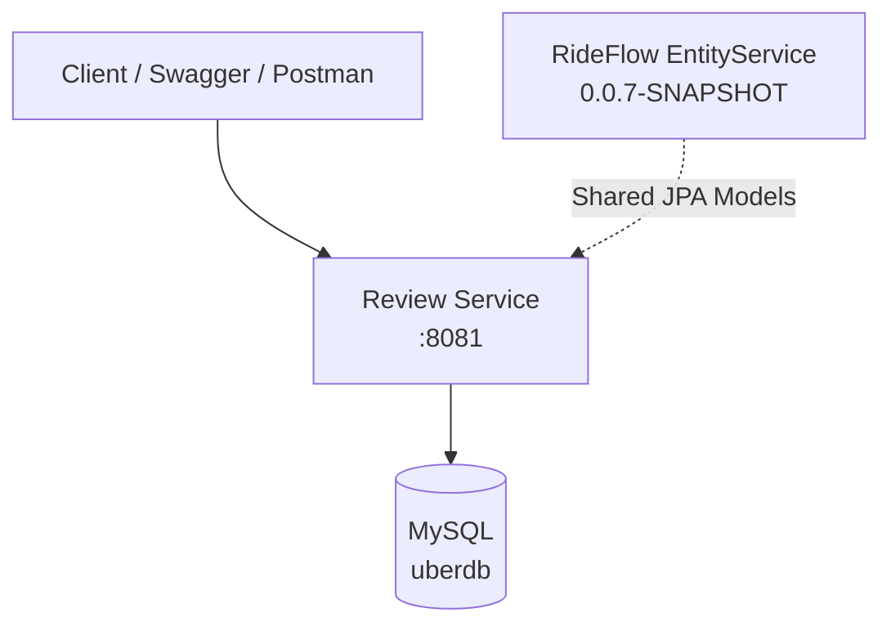

# RideFlow Review Service

RideFlow Review Service provides passenger and driver CRUD operations, a local booking lifecycle, and post-ride review functionality.

It belongs to the larger RideFlow project, but its booking workflow is intentionally different from the distributed Booking Service workflow.

Review Service performs its booking operations locally using JPA.

It does **not** currently call:

```text
Location Service
Socket Server
Redis
Kafka
```

during its booking workflow.

---

## Repository Naming

GitHub repository:

```text
ReviewService
```

Current Spring application name:

```text
UberReviewService
```

---

## Runtime

| Property              | Value                       |
| --------------------- | --------------------------- |
| Application           | `UberReviewService`         |
| Port                  | `8081`                      |
| Database              | MySQL / `uberdb`            |
| Persistence           | Spring Data JPA / Hibernate |
| Shared Entity Version | `0.0.7-SNAPSHOT`            |
| API Documentation     | Springdoc OpenAPI           |
| Schema Mode           | `validate`                  |

---

## What This Service Implements

* Passenger CRUD
* Driver CRUD
* Booking creation
* Driver assignment
* Booking lifecycle/state-machine validation
* Ride start/end time handling
* Passenger reviews
* One review per booking
* DTO mapping
* centralized exception handling
* Swagger/OpenAPI documentation

---

## High-Level Architecture



---

## Important Architectural Difference

RideFlow currently contains two booking-related implementations.

### Distributed Booking Service

```text
Booking Service
    +
Eureka
    +
Location Service
    +
Redis
    +
Socket Server
    +
WebSocket Driver Dispatch
```

### Review Service Booking Flow

```text
Review Service
    +
Local JPA
    +
Booking State Machine
    +
Review Workflow
```

Review Service does not currently participate in the distributed driver-dispatch workflow.

---

## Swagger / OpenAPI

Swagger UI:

```text
http://localhost:8081/swagger-ui.html
```

OpenAPI JSON:

```text
http://localhost:8081/v3/api-docs
```

OpenAPI YAML:

```text
http://localhost:8081/v3/api-docs.yaml
```

Swagger currently covers:

```text
/api/v1/**
```

Springdoc may redirect:

```text
/swagger-ui.html
```

to:

```text
/swagger-ui/index.html
```

---

## API Base URL

```text
http://localhost:8081/api/v1
```

---

# Passenger APIs

| Method | Endpoint           | Purpose             |
| ------ | ------------------ | ------------------- |
| POST   | `/passengers`      | Create passenger    |
| GET    | `/passengers/{id}` | Get passenger by ID |
| GET    | `/passengers`      | Get all passengers  |
| PUT    | `/passengers/{id}` | Update passenger    |
| DELETE | `/passengers/{id}` | Delete passenger    |

---

# Driver APIs

| Method | Endpoint        | Purpose          |
| ------ | --------------- | ---------------- |
| POST   | `/drivers`      | Create driver    |
| GET    | `/drivers/{id}` | Get driver by ID |
| GET    | `/drivers`      | Get all drivers  |
| PUT    | `/drivers/{id}` | Update driver    |
| DELETE | `/drivers/{id}` | Delete driver    |

---

# Booking APIs

| Method | Endpoint                | Purpose               |
| ------ | ----------------------- | --------------------- |
| POST   | `/bookings`             | Create booking        |
| GET    | `/bookings/{id}`        | Get booking by ID     |
| GET    | `/bookings`             | Get all bookings      |
| PATCH  | `/bookings/{id}/status` | Update booking status |

---

# Review APIs

| Method | Endpoint                       | Purpose               |
| ------ | ------------------------------ | --------------------- |
| POST   | `/reviews`                     | Create review         |
| GET    | `/reviews/{id}`                | Get review by ID      |
| GET    | `/reviews/booking/{bookingId}` | Get review by booking |

---

# Booking Creation Flow

Current booking creation works approximately like this:

```text
Passenger ID
      ↓
Load Passenger
      ↓
Find Available Driver
      ↓
Create Booking
      ↓
Assign Driver
      ↓
bookingStatus = ASSIGNED_DRIVER
      ↓
Persist Booking
```

---

## Driver Selection

The current implementation uses a placeholder driver-selection strategy.

It effectively selects the first driver returned from persistence.

Conceptually:

```text
driverRepository.findAll()
        ↓
first driver
```

It does **not** currently evaluate:

* geographic distance
* Redis driver location
* real-time driver availability
* driver workload
* vehicle type
* rating
* Socket connection status

The distributed Booking + Location + Socket flow is responsible for demonstrating those concerns elsewhere in RideFlow.

---

# Booking State Machine

The local Review Service booking lifecycle is:

```text
ASSIGNED_DRIVER
        ↓
CAB_ARRIVED
        ↓
STARTED
        ↓
IN_RIDE
        ↓
COMPLETED
```

---

## Cancellation

Cancellation is currently allowed from:

```text
ASSIGNED_DRIVER
CAB_ARRIVED
STARTED
```

---

## Terminal States

```text
COMPLETED
CANCELED
```

Once a booking reaches a terminal state, further state changes should be rejected.

---

## Allowed Transitions

| Current Status    | Allowed Next Status       |
| ----------------- | ------------------------- |
| `ASSIGNED_DRIVER` | `CAB_ARRIVED`, `CANCELED` |
| `CAB_ARRIVED`     | `STARTED`, `CANCELED`     |
| `STARTED`         | `IN_RIDE`, `CANCELED`     |
| `IN_RIDE`         | `COMPLETED`               |
| `COMPLETED`       | None                      |
| `CANCELED`        | None                      |

---

## Why State Validation Matters

Without transition validation, invalid flows could occur such as:

```text
ASSIGNED_DRIVER
      ↓
COMPLETED
```

or:

```text
COMPLETED
      ↓
STARTED
```

The state machine protects the business lifecycle from these invalid transitions.

---

# Booking Status Update

Endpoint:

```http
PATCH /api/v1/bookings/{bookingId}/status
```

Example:

```http
PATCH /api/v1/bookings/19/status
```

Request:

```json
{
  "newStatus": "CAB_ARRIVED"
}
```

Then continue sequentially:

```text
CAB_ARRIVED
     ↓
STARTED
     ↓
IN_RIDE
     ↓
COMPLETED
```

---

## Ride Start Time

When a booking transitions to:

```text
STARTED
```

the service records:

```text
startTime
```

---

## Ride End Time

When the booking reaches:

```text
COMPLETED
```

the service records:

```text
endTime
```

This keeps ride timestamps tied to lifecycle changes instead of relying entirely on client-provided values.

---

# Example Booking Response

```json
{
  "id": 19,
  "startTime": null,
  "endTime": null,
  "totalDistance": 0,
  "bookingStatus": "ASSIGNED_DRIVER",
  "driver": {
    "id": 1,
    "driverName": "Ravi K. Kumar"
  },
  "passenger": {
    "id": 1,
    "passengerName": "Anita S. Sharma"
  },
  "review": null
}
```

After completion:

```json
{
  "id": 19,
  "bookingStatus": "COMPLETED",
  "driver": {
    "id": 1,
    "driverName": "Ravi K. Kumar"
  },
  "passenger": {
    "id": 1,
    "passengerName": "Anita S. Sharma"
  }
}
```

---

# Review Workflow

The intended workflow is:

```text
Passenger Created
      ↓
Driver Created
      ↓
Booking Created
      ↓
Ride Progresses Through States
      ↓
Booking COMPLETED
      ↓
Review Created
```

---

## Review Rules

The service enforces business rules around review creation.

A review should be associated with a valid booking.

The implementation also prevents multiple reviews from being created for the same booking.

Conceptually:

```text
Booking
   ↓
Check booking state
   ↓
Check existing review
   ↓
Create review
```

---

# Recommended Swagger Testing Order

Open:

```text
http://localhost:8081/swagger-ui.html
```

Then test in this order:

```text
1. Create Driver
2. Create Passenger
3. Create Booking
4. Get Booking
5. Move Booking → CAB_ARRIVED
6. Move Booking → STARTED
7. Move Booking → IN_RIDE
8. Move Booking → COMPLETED
9. Create Review
10. Fetch Review
```

This order avoids foreign-key and booking-state issues.

---

# Suggested Negative Tests

The service is especially useful for testing business-rule failures.

---

## Passenger Not Found

Try creating a booking using a passenger ID that does not exist.

Expected behavior:

```text
Passenger not found
```

---

## No Driver Available

Create a booking when no drivers exist.

Expected behavior:

```text
No driver available
```

---

## Invalid Status Jump

Try:

```text
ASSIGNED_DRIVER
      ↓
COMPLETED
```

Expected:

```text
Invalid booking status transition
```

---

## Backward Transition

Try:

```text
IN_RIDE
   ↓
STARTED
```

Expected:

```text
Invalid booking status transition
```

---

## Update Terminal Booking

Try updating:

```text
COMPLETED
```

or:

```text
CANCELED
```

Expected:

```text
Transition rejected
```

---

## Duplicate Review

Create two reviews for the same booking.

Expected:

```text
Duplicate review rejected
```

---

# Postman Testing Guide

The repository contains:

```text
POSTMAN_TESTING_GUIDE.md
```

For the current application configuration, use:

```text
http://localhost:8081/api/v1
```

as the base URL.

If an older guide refers to:

```text
http://localhost:8080
```

replace it with:

```text
http://localhost:8081
```

because Review Service currently runs on port `8081`.

---

# Database Configuration

Current database:

```text
uberdb
```

Typical local configuration:

```properties
spring.datasource.url=jdbc:mysql://localhost:3306/uberdb
spring.datasource.username=root
spring.datasource.password=root
spring.datasource.driver-class-name=com.mysql.cj.jdbc.Driver
```

Create the database:

```sql
CREATE DATABASE uberdb;
```

---

# Hibernate Schema Validation

The current application uses:

```properties
spring.jpa.hibernate.ddl-auto=validate
```

This is important.

`validate` means Hibernate:

```text
Reads entity mappings
        ↓
Reads existing database schema
        ↓
Compares them
        ↓
Starts only if compatible
```

Hibernate does **not** automatically create or modify missing tables/columns in this mode.

---

## What Happens If the Schema Is Missing?

If a required table or column does not exist, application startup can fail with a schema-validation error.

Therefore the required schema must exist before Review Service starts.

---

# Flyway Status

The current Review Service build does not itself contain an active Flyway migration dependency/setup.

Therefore this README does not claim that Review Service automatically migrates the database.

The required shared database schema must already be available.

---

# Shared EntityService Integration

Review Service uses:

```text
com.rideflow:Rideflow-EntityService:0.0.7-SNAPSHOT
```

The JPA entities are provided by the shared EntityService artifact.

The application scans:

```text
com.rideflow.rideflowentityservice.models
```

using entity scanning.

Conceptually:

```text
Review Service
     ↓
EntityService JAR
     ↓
Passenger
Driver
Booking
Review
...
```

---

## Publish EntityService First

### Windows

```bash
cd Rideflow-EntityService
gradlew.bat publishToMavenLocal
```

### Linux / macOS

```bash
cd Rideflow-EntityService
./gradlew publishToMavenLocal
```

The Review Service build resolves the shared model from:

```text
mavenLocal()
```

---

# Technology Stack

* Java 17
* Spring Boot 4.1.0
* Spring MVC
* Spring Data JPA
* Hibernate
* MySQL
* Bean Validation
* Springdoc OpenAPI
* Lombok
* Gradle
* RideFlow EntityService

---

# Prerequisites

Before running Review Service:

* JDK 17+
* MySQL
* database `uberdb`
* compatible schema
* EntityService `0.0.7-SNAPSHOT`

Review Service does not currently require Redis, Kafka, Eureka, or Socket Server for its local booking/review workflow.

---

# Running the Application

### Windows

```bash
gradlew.bat bootRun
```

### Linux / macOS

```bash
./gradlew bootRun
```

Application:

```text
http://localhost:8081
```

Swagger:

```text
http://localhost:8081/swagger-ui.html
```

OpenAPI:

```text
http://localhost:8081/v3/api-docs
```

---

# Running Tests

### Windows

```bash
gradlew.bat test
```

### Linux / macOS

```bash
./gradlew test
```

---

# Project Structure

```text
src/main/java/
└── ...
    ├── advice/
    ├── configuration/
    │   └── OpenApiConfig.java
    ├── controller/
    │   ├── PassengerController.java
    │   ├── DriverController.java
    │   ├── BookingController.java
    │   └── ReviewController.java
    ├── dto/
    ├── exception/
    ├── mapper/
    ├── repository/
    ├── service/
    └── UberReviewServiceApplication.java
```

The domain entities are not maintained as duplicate local model classes.

They come from:

```text
Rideflow-EntityService
```

---

# Error Handling

The service contains business/error handling for scenarios such as:

* passenger not found
* driver not found
* booking not found
* review not found
* no drivers available
* duplicate driver licence number
* invalid booking status transition
* duplicate review
* invalid booking state for review
* deleting passengers referenced by bookings
* deleting drivers referenced by bookings
* request-validation failures

---

# Avoiding N+1 Review Queries

When fetching multiple bookings, the current implementation avoids repeatedly querying review information one booking at a time.

Conceptually, instead of:

```text
Booking 1 → query review
Booking 2 → query review
Booking 3 → query review
...
```

it loads review information together and maps it to bookings.

This helps reduce unnecessary database queries.

---

# Review Service vs Booking Service

This distinction is important when explaining the project in an interview.

## Review Service

Focuses on:

```text
CRUD
+
JPA
+
Business Rules
+
Booking State Machine
+
Reviews
```

## Booking Service

Focuses on:

```text
Distributed Orchestration
+
Eureka
+
Location Service
+
Redis GEO
+
Socket Server
+
Real-Time Driver Dispatch
```

These are currently separate implementations demonstrating different backend concepts.

---

# Current Implementation Notes

* Review Service runs on port `8081`.
* Swagger/OpenAPI is enabled.
* JPA entities come from EntityService `0.0.7-SNAPSHOT`.
* Hibernate uses `ddl-auto=validate`.
* Review Service itself does not currently run database migrations.
* driver selection currently uses the first persisted driver.
* driver proximity is not considered.
* driver availability is not meaningfully considered in the current placeholder selection.
* booking lifecycle transitions are validated.
* `STARTED` records `startTime`.
* `COMPLETED` records `endTime`.
* completed/canceled bookings act as terminal states.
* a booking can only have one review.

---

# Current Limitations

## Driver Selection

Current:

```text
Find all drivers
      ↓
Take first driver
```

A production-style implementation should consider:

```text
Availability
+
Distance
+
Approval status
+
Vehicle type
+
Current workload
```

---

## Shared Database

Review Service shares `uberdb` with other RideFlow services during development.

This makes integration easier but creates stronger coupling than a strict database-per-service architecture.

---

## Shared JPA Model

Using EntityService simplifies the project but means model changes can affect multiple applications simultaneously.

A more independently deployed microservice architecture would usually own service-specific persistence models.

---

# Future Improvements

* connect review workflow to the distributed booking lifecycle
* replace first-driver selection with real availability/proximity logic
* introduce service-specific persistence ownership
* add API security
* add pagination for list APIs
* add sorting/filtering
* add integration tests using Testcontainers
* add optimistic locking for booking transitions
* add database migrations owned by the service
* add Actuator health endpoints
* add metrics and tracing
* externalize database credentials
* version REST contracts

---

## Parent Project

See the complete RideFlow platform:

[RideFlow](https://github.com/Abhilash-Panja/RideFlow)
